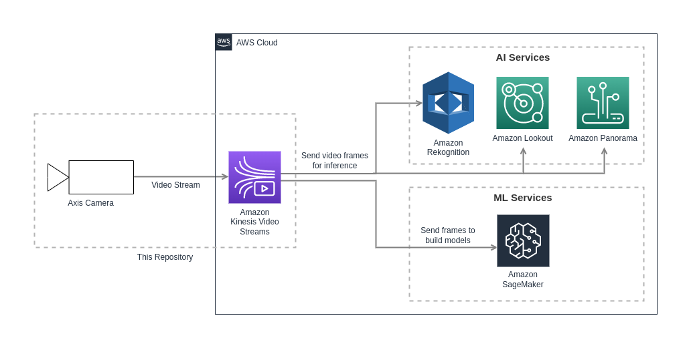

*©2023 Axis Communications AB. AXIS COMMUNICATIONS, AXIS, ARTPEC and VAPIX are registered trademarks of Axis AB in various jurisdictions. All other trademarks are the property of their respective owners.*

<!-- omit in toc -->
# Application for Amazon Kinesis Video Streams

The Application for Amazon Kinesis Video Streams can be run on a virtualization enabled
Axis camera as a container, making it possible to stream video to
[Amazon Kinesis Video Streams](https://aws.amazon.com/kinesis/video-streams/). The
stream can thereafter be fed into other AWS services such as [Amazon Rekognition](https://aws.amazon.com/rekognition/) to
perform image and or video analytics.



<!-- omit in toc -->
## Table of contents

- [Target Audience](#target-audience)
- [Requirements](#requirements)
- [Option 1: Access Kinesis Video Streams resources using IAM](#option-1-access-kinesis-video-streams-resources-using-iam)
    - [Variables](#variables)
        - [Container Build Variables](#container-build-variables)
        - [Container Runtime Variables](#container-runtime-variables)
    - [Install](#install)
        - [From Docker Hub](#from-docker-hub)
        - [Build Locally](#build-locally)
- [Option 2: Access Kinesis Video Streams resources using AWS IoT](#option-2-access-kinesis-video-streams-resources-using-aws-iot)
    - [Prerequisites](#prerequisites)
    - [Creating the Certificate Files](#creating-the-certificate-files)
    - [Install](#install-1)
        - [From Docker Hub](#from-docker-hub-1)
        - [Build Locally](#build-locally-1)
- [Run on the Camera](#run-on-the-camera)
    - [Save and Load the Image to the Camera](#save-and-load-the-image-to-the-camera)
    - [Starting the Container](#starting-the-container)
- [Use case - Event based Amazon Kinesis Video Streams](#use-case---event-based-amazon-kinesis-video-streams)
- [Verify That the Amazon Kinesis Video Stream is Successfully Running](#verify-that-the-amazon-kinesis-video-stream-is-successfully-running)
- [Known Limitations](#known-limitations)
- [Disclaimer](#disclaimer)
- [License](#license)

## Target Audience

This repository is intended for [low code developers](https://en.wikipedia.org/wiki/Low-code_development_platform) building integration
offerings to connect and stream Axis cameras video into the Amazon Kinesis Video Streams service.

## Requirements

The following setup is supported:

- Camera
    - Chip: ARTPEC-{7-8} [Virtualization/Container enabled devices](https://www.axis.com/support/tools/product-selector/shared/%5B%7B%22index%22%3A%5B4%2C2%5D%2C%22value%22%3A%22Yes%22%7D%5D) (e.g., Q1615 MkIII, P3265-LV)
    - Firmware: Refer to product specific documentation (e.g. <https://www.axis.com/products/axis-p3265-lv/support>)
    - [Docker ACAP](https://github.com/AxisCommunications/docker-acap) installed and started, using TLS and SD card as storage

- Computer
    - OS: Linux/macOS running preferred shell, or Windows with WSL2 installed to run Bash on Windows
    - AWS Account with [security credentials](https://docs.aws.amazon.com/IAM/latest/UserGuide/id_credentials_access-keys.html) generated
        - [Option 1: Access Kinesis Video Streams resources using IAM](#option-1-access-kinesis-video-streams-resources-using-iam)
            - Access key ID
            - Secret access key
        - [Option 2: Access Kinesis Video Streams resources using AWS IoT](#option-2-access-kinesis-video-streams-resources-using-aws-iot)
            - Option 2.1. Using AWS IoT certificate alone
            - Option 2.2. Generating temporary credentials (temporary access key ID, secret access key and session token) from the IoT certificate
    - AWS CLI
        - [Getting started with the AWS CLI](https://docs.aws.amazon.com/cli/latest/userguide/cli-chap-getting-started.html)
            - Ensure to choose a region that supports Amazon Kinesis Video Streams.
    - [Docker](https://docs.docker.com/get-docker/) with BuildKit enabled
    - [Docker Compose](https://docs.docker.com/compose/install/)
    - Only required for option 2: [jq](https://stedolan.github.io/jq/), a lightweight command-line JSON processor

> **Note** Developers are recommended to follow [AWS Credentials access best practices](https://docs.aws.amazon.com/accounts/latest/reference/credentials-access-keys-best-practices.html) in safeguarding the credentials included
> in developer machine configuration.

## Option 1: Access Kinesis Video Streams resources using IAM

When setting up an IAM user or a role for streaming to Amazon Kinesis Video Streams, see the [official AWS documentation](https://docs.aws.amazon.com/kinesisvideostreams/latest/dg/how-iam.html) describing how to define permissions.

### Variables

To run the solution, a number of variables need to be added. These will be used for building or pulling the Docker image and
running it.

#### Container Build Variables

Add the IMAGE_NAME as a shell variable so that it can be reused:

```sh
export IMAGE_NAME=axisecp/kinesis-video-stream-application
```

Also, add the IMAGE_TAG:

```sh
export IMAGE_TAG=latest-<armv7hf or aarch64>
```

where the IMAGE_TAG is `latest-armv7hf` for ARTPEC-7 and `latest-aarch64` for
ARTPEC-8 devices.

#### Container Runtime Variables

Before running the solution, environment variables need to be set up.
Create a file named `.env` in the root directory of this repository, it will contain data to communicate with the camera and
AWS. After creating the file, add the content below to the file and fill in the corresponding values:

```sh
# Camera specific variables
DEVICE_USERNAME=<camera username>
DEVICE_PASSWORD=<camera password>

# AWS related variables
AWS_KINESIS_STREAM_NAME=<Amazon Kinesis video stream name>
AWS_REGION=<AWS region>
AWS_ACCESS_KEY_ID=<AWS access key ID>
AWS_SECRET_ACCESS_KEY=<AWS secret key>
```

### Install

The image can be retrieved by either pulling it from Docker Hub, or by building
it locally.

#### From Docker Hub

Get the Docker image by pulling it from Docker Hub:

```sh
docker pull ${IMAGE_NAME}:${IMAGE_TAG}
```

#### Build Locally

Add the architecture for the Docker image as a shell variable, depending on the camera
system-on-chip. Use `arm32v7` for ARTPEC-7 devices:

```sh
export ARCH=arm32v7
```

and `arm64v8` for ARTPEC-8:

```sh
export ARCH=arm64v8
```

Once the shell variables have been added, the Docker image can be built:

```sh
docker buildx build --tag ${IMAGE_NAME}:${IMAGE_TAG} --build-arg ARCH --build-arg KVS_CPP_PRODUCER_SDK_TAG=v3.3.1 .
```

## Option 2: Access Kinesis Video Streams resources using AWS IoT

Amazon Kinesis Video Streams do not support certificate-based authentication, however, AWS IoT has a credentials provider that allows
you to use the built-in X.509 certificate as the unique device identity to authenticate AWS requests.

### Prerequisites

To create the certificate, the following AWS resources need to be set up.

- An IoT Thing Type and an IoT Thing.
- An IAM Role to be assumed by IoT.
- X.509 certificate created and configured.

AWS provides [documentation](https://docs.aws.amazon.com/kinesisvideostreams/latest/dg/how-iot.html) for how to set the above
prerequisites up. However, to simplify the process of setting up an IAM Role assumed by IoT, policies, certificate etc, a [script](https://github.com/AxisCommunications/axis-aws-kinesis-vsp/blob/main/x509-authentication/certificate_files/generate_certificate.sh)
is provided.

If the prerequisites are set up by following the
[documentation](https://docs.aws.amazon.com/kinesisvideostreams/latest/dg/how-iot.html) from AWS the step [Creating the certificate files](#creating-the-certificate-files) below can be skipped.

### Creating the Certificate Files

1. Create a file named `.env` in the `x509-authentication` directory of this repository, it will contain data to communicate with
    the camera and AWS. Add the content below to the file and fill in the corresponding values:

    > **Note** For the `generate_certificate.sh` script and Docker Compose to pick up the environment variables the file needs to be named `.env`
    **and** be placed in the `x509-authentication` directory.

    ```sh
    DEVICE_USERNAME=<camera username>
    DEVICE_PASSWORD=<camera password>
    GST_PLUGIN_PATH=/opt/app/amazon-kinesis-video-streams-producer-sdk-cpp/build
    # PROXY=<proxy address, needed if camera is behind a proxy>

    # AWS related variables
    AWS_KINESIS_STREAM_NAME=<Amazon Kinesis video stream name>
    AWS_REGION=<AWS region>
    AWS_CREDENTIAL_PROVIDER=<AWS credential provider, see next step for how to fetch it>
    AWS_ROLE_ALIAS=<Pick a name for the AWS Role Alias>

    # Additional AWS variables needed for generating certificate
    AWS_THING=$AWS_KINESIS_STREAM_NAME
    AWS_THING_TYPE=<Pick a name for the AWS Thing Type>
    AWS_ROLE=<Pick a name for the AWS Role>
    AWS_IAM_POLICY=<Pick a name for the AWS IAM Policy>
    AWS_IOT_POLICY=<Pick a name for the AWS IOT Policy>
    AWS_ROOT_CA_ADDRESS=https://www.amazontrust.com/repository/SFSRootCAG2.pem
    ```

    It's required that the value of `AWS_THING` is identical to the value of `AWS_KINESIS_STREAM_NAME`.

    To fetch the credentials provider the following command can be used:

    ```sh
    aws --profile default iot describe-endpoint --endpoint-type iot:CredentialProvider --output text
    ```

2. Step into the `certificate_files` directory and run the following command to generate certificate and keys:

    > **Note** This step can be skipped if setting up the certificate manually according to the [AWS documentation](https://docs.aws.amazon.com/kinesisvideostreams/latest/dg/how-iot.html).

    If `AWS CLI` is configured with `output = json` the script can be run as:

    ```sh
    ./generate_certificate.sh ../.env
    ```

    If another configuration is set, `AWS_DEFAULT_OUTPUT="json"` can be added to the call instead, i.e.:

    ```sh
    AWS_DEFAULT_OUTPUT="json" ./generate_certificate.sh ../.env
    ```

    > **Note** Currently the script only supports a profile named `default` for the calls made towards AWS CLI. If you like it to use another profile read about [Named profiles for the AWS CLI](https://docs.aws.amazon.com/cli/latest/userguide/cli-configure-profiles.html) in the AWS documentation and update the script accordingly.

### Install

There's two options for how to run an image using the generated certificate. Either by building the certificate into an image or by generating temporary credentials from the certificate.

- To be able to build or pull the image, set the following environment variables in your shell:

    ```sh
    export IMAGE_NAME=axisecp/kinesis-video-stream-application
    export IMAGE_TAG=<Choose either latest-armv7hf or latest-aarch64>
    export DEVICE_IP=<camera IP>
    ```

#### From Docker Hub

With this option the image need **not** be rebuilt. To use this option the following steps needs to be performed:

1. Generate the temporary credentials by running the `generate_temporary_credentials.sh` script in the `x509-authentication/certificate` folder similar to how the certificate was generated:

    ```sh
    ./generate_temporary_credentials.sh ../.env
    ```

    The script will echo the temporary credentials and environment variables to set:

    ```sh
    ./generate_temporary_credentials.sh ../.env
    Temporary credentials created with an expiration date set to:2023-02-15T19:54:53Z

    Run the following command in your shell to export the temporary credentials so that they can be picked up by Docker Compose.
    export AWS_ACCESS_KEY_ID=********************
    export AWS_SECRET_ACCESS_KEY=******************
    export AWS_SESSION_TOKEN=************************
    ```

2. Follow the instructions and export the variables:

    ```sh
    export AWS_ACCESS_KEY_ID=********************
    export AWS_SECRET_ACCESS_KEY=******************
    export AWS_SESSION_TOKEN=************************
    ```

    > **Note** The actual values are much longer than the substitutes above `*****`

3. When using temporary credentials, the same image as the one from [Option 1: Access Kinesis Video Streams resources using IAM](#option-1-access-kinesis-video-streams-resources-using-iam) can be used.
Pull the image from DockerHub by running the following command:

    ```sh
    docker pull ${IMAGE_NAME}:${IMAGE_TAG}
    ```

4. Copy the recently created .env file and paste it into the root directory of the repository, so that Docker Compose can pick up all the required variables.

5. Change directory to the root folder of the repository. This is needed to run the application from the correct directory in the 'Run on the Camera' section below.

#### Build Locally

With this option the image **need to be rebuilt** to include the certificate. To use this option the following steps needs to be performed:

1. Step back into the `x509-authentication` directory and build an image:

    ```sh
    docker buildx build --tag ${IMAGE_NAME}:${IMAGE_TAG} --build-arg IMAGE_TAG=$IMAGE_TAG .
    ```

2. Create the Amazon Kinesis Video Stream.

    If the policy is set with the script above or according to the [AWS documentation](https://docs.aws.amazon.com/kinesisvideostreams/latest/dg/how-iot.html),
    permission will **not** be set for `KinesisVideo:CreateStream` action. I.e. the stream will have to be created manually.

    ```sh
    aws kinesisvideo create-stream --data-retention-in-hours 2 --stream-name <name of the stream used in above steps>
    ```

    > **Note** The stream name must be the same as the name of the Thing created earlier.

## Run on the Camera

### Save and Load the Image to the Camera

Add the camera's IP address as a shell variable:

```sh
export DEVICE_IP=<camera IP>
```

Clear Docker memory:

```sh
docker --tlsverify -H $DEVICE_IP:2376 system prune --all --force
```

If you encounter any TLS related issues, please see the TLS setup chapter regarding the `DOCKER_CERT_PATH` environment variable
in the [Docker ACAP repository](https://github.com/AxisCommunications/docker-acap).

The image can now be saved and loaded to the camera:

```sh
docker save ${IMAGE_NAME}:${IMAGE_TAG} | docker --tlsverify -H $DEVICE_IP:2376 load
```

### Starting the Container

To start the container you can use Docker Compose:

```sh
docker --tlsverify -H $DEVICE_IP:2376 compose up
```

or:

```sh
docker --tlsverify -H $DEVICE_IP:2376 compose up -d
```

to run in detached (background) mode.

Once the `docker compose` command has been run, an RTSP stream is set up with the
`start_stream.sh` script. The AWS GStreamer plugin kvssink sends media based on
the Matroska container format to Amazon Kinesis Video Streams. The plugin is set up
with default values, however these values can be modified according to the
[kvssink parameter reference](https://docs.aws.amazon.com/kinesisvideostreams/latest/dg/examples-gstreamer-plugin-parameters.html)
.

## Use case - Event based Amazon Kinesis Video Streams

This repository also includes an example use case [start-on-app-event](./start-on-app-event) that generates [Amazon Kinesis Video Streams](https://aws.amazon.com/kinesis/video-streams/) based on an event triggered by rules created with Axis analytics applications like [AXIS Object Analytics](https://www.axis.com/products/axis-object-analytics) or
[AXIS Video Motion Detection](https://www.axis.com/products/axis-video-motion-detection).

## Verify That the Amazon Kinesis Video Stream is Successfully Running

The most straightforward way to verify that the stream from the camera actually
reaches Amazon Kinesis Video Streams is to do it from the AWS UI.

1. Log in to your AWS account.
2. Search for and go to the Amazon Kinesis Video Streams service.
3. Make sure that you are in the correct AWS region, and select the Amazon Kinesis
video stream in the list.
4. Click the **Media Playback** button.
5. If everything is set up correctly, the stream should show up. Wait a number
of seconds since there might be a delay.

## Known Limitations

When streaming to Amazon Kinesis Video Streams there is a latency which can be
affected by the selected AWS region, network setup and video resolution.

## Disclaimer

<!-- textlint-disable -->

This document and its content are provided courtesy of Axis and all rights to the document shall remain vested in Axis Communications AB. AXIS COMMUNICATIONS, AXIS, ARTPEC and VAPIX are registered trademarks of Axis AB in various jurisdictions. Amazon Web Services, AWS and the Powered by AWS logo are trademarks of Amazon.com, Inc. or its affiliates. Docker and the Docker logo are trademarks or registered trademarks of Docker, Inc. in the United States and/or other countries. Docker, Inc. and other parties may also have trademark rights in other terms used herein. All other trademarks are the property of their respective owners, and we are not affiliated with, endorsed or sponsored by them or their affiliates.

As described in this document, you may be able to connect to, access and use third party products, web sites, example code, software or services (“Third Party Services”). You acknowledge that any such connection and access to such Third Party Services are made available to you for convenience only. Axis does not endorse any Third Party Services, nor does Axis make any representations or provide any warranties whatsoever with respect to any Third Party Services, and Axis specifically disclaims any liability or obligations with regard to Third Party Services. The Third Party Services are provided to you in accordance with their respective terms and conditions, and you alone are responsible for ensuring that you (a) procure appropriate rights to access and use any such Third Party Services and (b) comply with the terms and conditions applicable to its use.

PLEASE BE ADVISED THAT THIS DOCUMENT IS PROVIDED “AS IS” WITHOUT WARRANTY OF ANY KIND, AND IS NOT INTENDED TO, AND SHALL NOT, CREATE ANY LEGAL OBLIGATION FOR AXIS COMMUNICATIONS AB AND/OR ANY OF ITS AFFILIATES. THE ENTIRE RISK AS TO THE USE, RESULTS AND PERFORMANCE OF THIS DOCUMENT AND ANY THIRD PARTY SERVICES REFERENCED HEREIN IS ASSUMED BY THE USER OF THE DOCUMENT AND AXIS DISCLAIMS AND EXCLUDES, TO THE MAXIMUM EXTENT PERMITTED BY LAW, ALL WARRANTIES, WHETHER STATUTORY, EXPRESS OR IMPLIED, INCLUDING BUT NOT LIMITED TO ANY IMPLIED WARRANTIES OF MERCHANTABILITY, FITNESS FOR A PARTICULAR PURPOSE, TITLE AND NON-INFRINGEMENT AND PRODUCT LIABILITY.

<!-- textlint-enable -->

## License

Example Code means the examples provided by Axis in this document within the grey text boxes.

Example Code ©2023 Axis Communications AB is licensed under the [Apache License, Version 2.0 (the “License”)](./LICENSE). You may not use the Example Code except in compliance with the License.

You may obtain a copy of the License at <https://www.apache.org/licenses/LICENSE-2.0>. Example Code distributed under the License is distributed on an “AS IS” BASIS, WITHOUT WARRANTIES OR CONDITIONS OF ANY KIND, either express or implied. See the License for the specific language governing permissions and limitations under the License.
