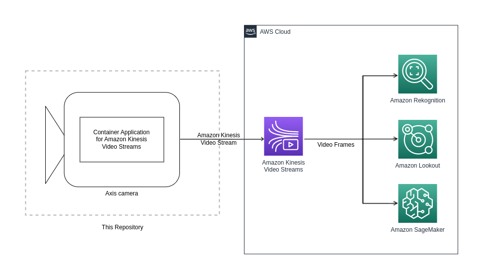

# AWS Kinesis Video Stream Application

The AWS Kinesis Video Stream Application can be run on a virtualization enabled
Axis camera as a container, making it possible to stream video to
[AWS Kinesis Video Streams](https://aws.amazon.com/kinesis/video-streams/). The
stream can thereafter be fed into other AWS services such as Rekognition to
perform image and or video analytics.



## Requirements

The following setup is supported:

- Camera
  - Chip: ARTPEC-{7-8} DLPU devices (e.g., Q1615 MkIII)
  - Firmware: 10.9 or higher
  - [Docker ACAP](https://github.com/AxisCommunications/docker-acap) installed and started, using TLS and SD card as storage

- Computer
  - OS: Linux/macOS running preferred shell, or Windows 10 with WSL2 installed to run Bash on Windows
  - AWS Account with
[security credentials](https://docs.aws.amazon.com/IAM/latest/UserGuide/id_credentials_access-keys.html) generated
    - Access key ID
    - Secret access key
  - [Docker](https://docs.docker.com/get-docker/) with BuildKit enabled
  - [Docker Compose](https://docs.docker.com/compose/install/)

## Variables

To run the solution, a number of variables need to be added. These will be used for building or pulling the Docker image and
running it.

### Shell Variables

Add the image name as a shell variable so that it can be reused:

```sh
IMAGE_NAME=axisecp/kinesis-video-stream-application
```

Also, add the image tag:

```sh
IMAGE_TAG=latest-<armv7hf or aarch64>
```

where the image tag is `latest-armv7hf` for ARTPEC-7 and `latest-aarch64` for
ARTPEC-8 devices.

### Environment Variables

Before running the solution, environment variables need to be set up.
Create a file named __.env__ in the root directory of this repository, it will contain data to communicate with the camera and
AWS. After creating the file, add the content below to the file and fill in the corresponding values:

```sh
# Camera specific variables
DEVICE_USERNAME=<camera username>
DEVICE_PASSWORD=<camera password>

# AWS related variables
AWS_KINESIS_STREAM_NAME=<AWS Kinesis video stream name>
AWS_REGION=<AWS region>
AWS_ACCESS_KEY_ID=<AWS access key ID>
AWS_SECRET_ACCESS_KEY=<AWS secret key>
```

## Install

The image can be retrieved by either pulling it from Docker Hub, or by building
it locally.

### From Docker Hub

Get the Docker image by pulling it from Docker Hub:

```sh
docker pull ${IMAGE_NAME}:${IMAGE_TAG}
```

### Build Locally

Add the architecture for the Docker image as a shell variable, depending on the camera
system-on-chip. Use `arm32v7` for ARTPEC-7 devices:

```sh
ARCH=arm32v7
```

and `arm64v8` for ARTPEC-8:

```sh
ARCH=arm64v8
```

Once the shell variables have been added, the Docker image can be built:

```sh
docker buildx build --tag ${IMAGE_NAME}:${IMAGE_TAG} --build-arg ARCH --build-arg KVS_CPP_PRODUCER_SDK_TAG=v3.3.1 .
```

## Run on the Camera

### Save and Load the Image to the Camera

Add the camera's IP address as a shell variable:

```sh
DEVICE_IP=<camera IP>
```

Clear Docker memory:

```sh
docker --tlsverify -H $DEVICE_IP:2376 system prune --all --force
```

If you encounter any TLS related issues, please see the TLS setup chapter regarding the `DOCKER_CERT_PATH` environment variable
in the [Docker ACAP repository](https://github.com/AxisCommunications/docker-acap).

The image can now be saved and loaded to the camera:

```sh
docker save ${IMAGE_NAME}:${IMAGE_TAG} | docker --tlsverify -H $DEVICE_IP:2376 load
```

### Starting the Container

To start the container you can use Docker Compose:

```sh
docker-compose --tlsverify -H $DEVICE_IP:2376 up
```

or:

```sh
docker-compose --tlsverify -H $DEVICE_IP:2376 up -d
```

to run in detached (background) mode.

Once the `docker-compose` command has been run, an RTSP stream is set up with the
`start_stream.sh` script. The AWS GStreamer plugin kvssink sends media based on
the Matroska container format to AWS Kinesis Video Streams. The plugin is set up
with default values, however these values can be modified according to the
[kvssink parameter reference](https://docs.aws.amazon.com/kinesisvideostreams/latest/dg/examples-gstreamer-plugin-parameters.html)
.

## Verify That the Kinesis Video Stream is Successfully Running

The most straightforward way to verify that the stream from the camera actually
reaches Kinesis Video Streams is to do it from the AWS UI.

1. Log in to your AWS account.
2. Search for and go to the Kinesis Video Streams service.
3. Make sure that you are in the correct AWS region, and select the Kinesis
video stream in the list.
4. Click the 'Media Playback' button.
5. If everything is set up correctly, the stream should show up. Wait a number
of seconds since there might be a delay.

## Known Limitations

When streaming to AWS Kinesis Video Streams there is a latency which can be
affected by the selected AWS region, network setup and video resolution.
