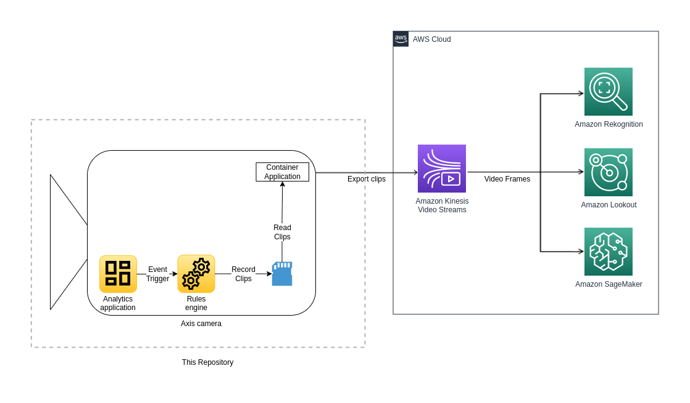

# Application Event Based Streaming

This is an example of how the [AWS Kinesis Video Stream Application](..)
can be extended to only stream to [AWS Kinesis Video Streams](https://aws.amazon.com/kinesis/video-streams/) when an object or
motion is detected by either [Axis Object Analytics](https://www.axis.com/products/axis-object-analytics) (AOA) or
[Axis Video Motion Detection](https://www.axis.com/products/axis-video-motion-detection) (VMD). When the example is run, an
action rule and a scenario or profile is created in either AOA or VMD. The rule records clips and saves them to the SD-card when
events occur in either application. Each recording is streamed to
[Amazon Kinesis Video Streams](https://aws.amazon.com/kinesis/video-streams/).



## Requirements

Same as for the main application. See the requirements section in [AWS Kinesis Video Stream Application](..).

## Variables

To run the solution, a number of variables need to be added. These will be used for building or pulling the Docker image and
running it.

### Shell Variables

Add the image name as a shell variable:

```sh
IMAGE_NAME=kvs-start-on-app-event
```

Also, add the image tag:

```sh
IMAGE_TAG=latest
```

### Environment Variables

Before running the solution, environment variables need to be set up. The environment variables are the same as for the main
application, with the exception of adding a variable called APPNAME relating to the application used for generating events.
Create a file named `.env` in the root directory of this repository, it will contain data to communicate with the camera and
AWS. After creating the file, add the content below to the file and fill in the corresponding values:

```sh
# Camera specific variables
DEVICE_USERNAME=<camera username>
DEVICE_PASSWORD=<camera password>

# AWS related variables
AWS_KINESIS_STREAM_NAME=<AWS Kinesis video stream name>
AWS_REGION=<AWS region>
AWS_ACCESS_KEY_ID=<AWS access key ID>
AWS_SECRET_ACCESS_KEY=<AWS secret key>

# Specify the application to use, either 'objectanalytics' or 'vmd'
APPNAME=<objectanalytics or vmd>
```

## Install

### Build Locally

Add the architecture for the Docker image as a shell variable, depending on the camera
system-on-chip. Use `armv7hf` for ARTPEC-7 devices:

```sh
ARCH=armv7hf
```

and `aarch64` for ARTPEC-8:

```sh
ARCH=aarch64
```

Once the shell variables have been added, the Docker image can be built:

```sh
docker buildx build --tag $IMAGE_NAME --build-arg ARCH .
```

## Run on the Camera

### Save and Load the Image to the Camera

Same as for the main application. See the save and load section in [AWS Kinesis Video Stream Application](..).

## Verify That the Kinesis Video Stream is Successfully Running

The most straightforward way to verify that the stream from the camera actually
reaches Kinesis Video Streams is to do it from the AWS UI.

1. Go to either the AOA or VMD app on the camera and view the created profile or scenario. (e.g.  http://192.168.0.1/local/vmd/index.html or  http://192.168.0.1/local/objectanalytics/index.html).
2. Trigger an event by clicking the button 'Test alarm'
3. Log in to your AWS account.
4. Search for and go to the Kinesis Video Streams service.
5. Make sure that you are in the correct AWS region, and select the Kinesis
video stream in the list.
6. Click the 'Media Playback' button.
7. If everything is set up correctly, the stream should show up. Wait a number
of seconds since there might be a delay.

## Known Limitations

When streaming to AWS Kinesis Video Streams there is a latency which can be
affected by the selected AWS region, network setup and video resolution. This means that eventual event triggered recordings might
appear in Amazon Kinesis Video Streams with a noticeable delay.
